ToolSEG2.1 Software User Manual

1. Introduction 
================

>   ToolSEG is an open-source, cross-platform Java application that integrates
>   simulation data

generation and segmentation achievement. The methods in the system include HMM,
PCF, FastPCF, CBS, CLT and Lasso. It not only can be used for comparison between
the methods, as well as meeting the needs of the actual segmentation. Most
importantly, we will be staging structured. Each segment corresponding method
parameters can be adjusted to facilitate users find problems. The input to be
segmented can be the data generated by users or the inputdata that has the
certain format. To meet with diverse needs and applications in the cancer
research community, ToolSEG not only output .txt file of segmentation result
that can be used for further analysis, such as estimates purity and ploidy, but
also outputs graphical results that help intuitive understanding of the effect
of segmentation. The software and source code of ToolSEG could be downloaded
from <https://git.oschina.net/whut3steam/ToolSeg.git>. An example of use is
provided.

2. Software System Requirement
==============================

The Java Runtime Environment (JRE) version 1.8 or higher is required to be
installed and configured properly. JRE could be downloaded at

<http://www.oracle.com/technetwork/java/javase/downloads/jre8-downloads-2133155.html>

3. Installation 
================

**Step 1:** Download a Java IDE and an up-to-date Java Development Kit (JDK).

The application uses the IntelliJ IDEA Community Edition 14.1.4 and Java SE 8.

IntelliJ IDEA Community Edition 14.1.4 could be downloaded at

<http://www.jetbrains.com/idea/#chooseYourEdition> ,as is shown in Figure 1.

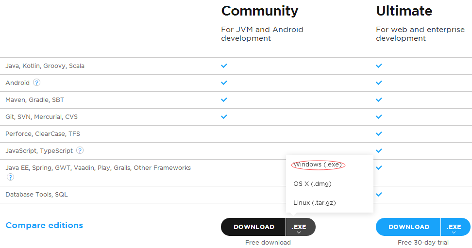

Figure 1.IntelliJ IDEA Community Edition 14.1.4 download

Java SE 8 could be downloaded at

<http://www.oracle.com/technetwork/java/javase/downloads/index.html>, as is
shown in Figure 2.

**Step 2:** Install both software using the installation wizards. It is
recommended to install the JDK first because IntelliJ IDEA Community will then
automatically use the JDK as the base platform; otherwise, you will have to
browse for the folder the JDK was installed to so IntelliJ IDEA Community will
know which Java Platform to use.

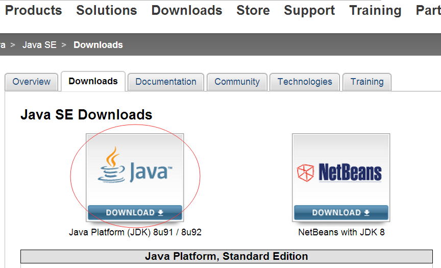

Figure 2.Java SE download

**Step 3:** Open up the IntelliJ IDEA Community application. Once it has
finished loading, click “Check out from Version Control” and “Git”, as is shown
in Figure 3.

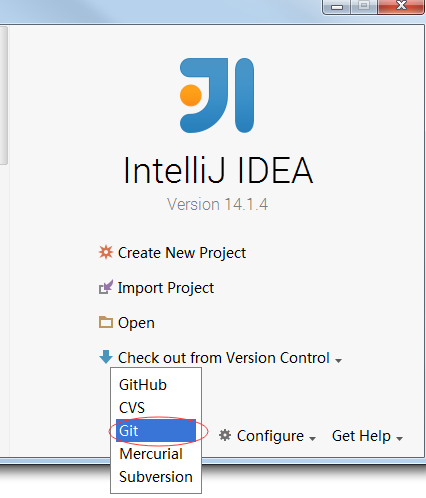

Figure 3.Git

In the colum of “Git Repository URL”,input the URL

<https://git.oschina.net/whut3steam/ToolSeg.git>,and the default of the colum of
Directory will be “ToolSeg”,the name of the project. In the colum of Parent
Directory,input any directory you like.

Then,click “Test”, as is shown in Figure 4. When connection has been successful,
click “OK”. Finally, click “Clone”, as is shown in Figure 5.

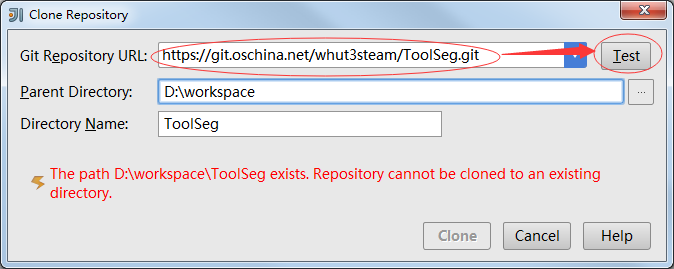

Figure 4.Test the project

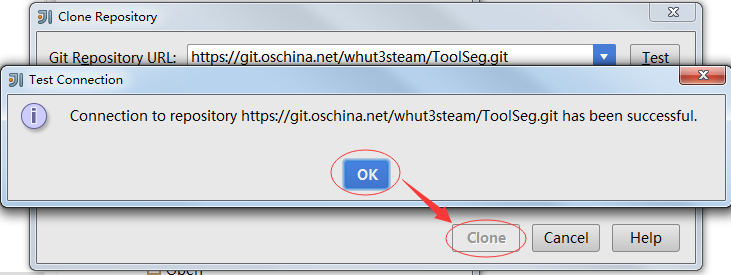

Figure 5.Clone the project

**Step 4:** Add packages and .jar files.First, add three packages in the path
ToolSEG, jars, Pictures, Result. Second, download some .jar files and save them
in the path ToolSEG//jars. The .jar files include “commons-math3-3.3.jar”,
“jahmm-0.6.1.jar”, “javaml-0.1.7.jar”, “smile.jar”, “sqlite-jdbc-3.8.7.jar”,
“jcommon-1.0.23.jar”, “jfreechart-1.0.19.jar” and “servlet-api-2.5.jar”.

**Step 5:** Now, the whole project is open, simply find the green arrow at the
top of the IntelliJ IDEA Community window and click it to Run, as is shown in
Figure 6.

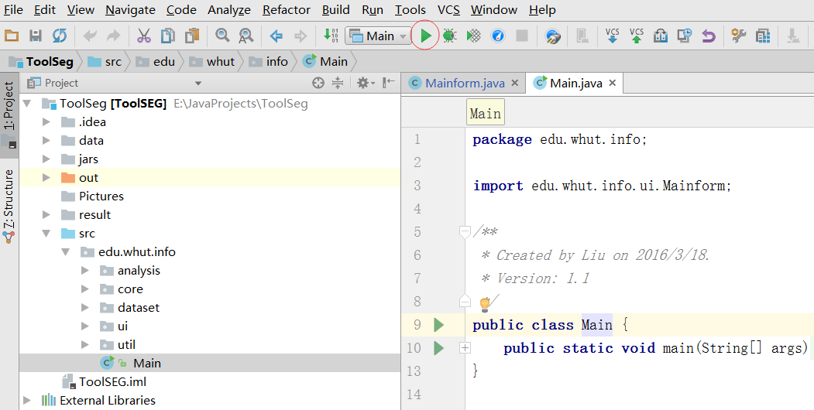

Figure 6.Run the project

4. Usage 
=========

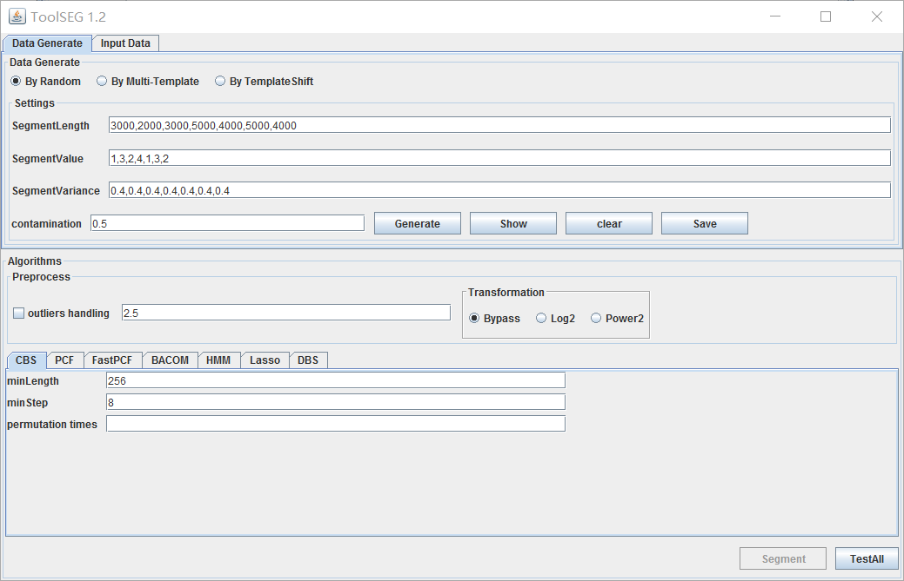

Figure 7.The GUI

>   The GUI contains two modules：Input Selection, Algorithms, as is shown in
>   Figure 7.

1) Input Selection Module

>   The first module is “Input Selection”, where user can choose the input data
>   they need.

There are two data sources users can choose.

>   The first data source is “Data Generate”, by which, users can generate datas
>   they like. They can generate datas by random, by multi-template or by
>   template shift. They can set the datas’ format. As shown in the figure 8,we
>   set a data that has four segments. Their lengths are respectively 300, 300,
>   300, 300. Their segment values are respectively 1, 2, 3, 4. Their segment
>   variances are respectively 0.4, 0.4, 0.4, 0.4. And their contaminations are
>   all 0.5. Click “Generate”, the data will be generated,as shown in figure 9.

>   Click “Show”, we can see the figure, as shown in figure 10. Click “Clear”,
>   the data generated will be cleared. Click “Save”, the data genereted will be
>   saved as .txt file in the path “..//data”.

>   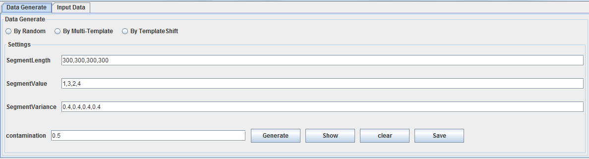

>   Figure 8. Input Selection Module

>   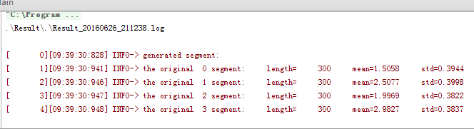

>   Figure 9.Data generated

>   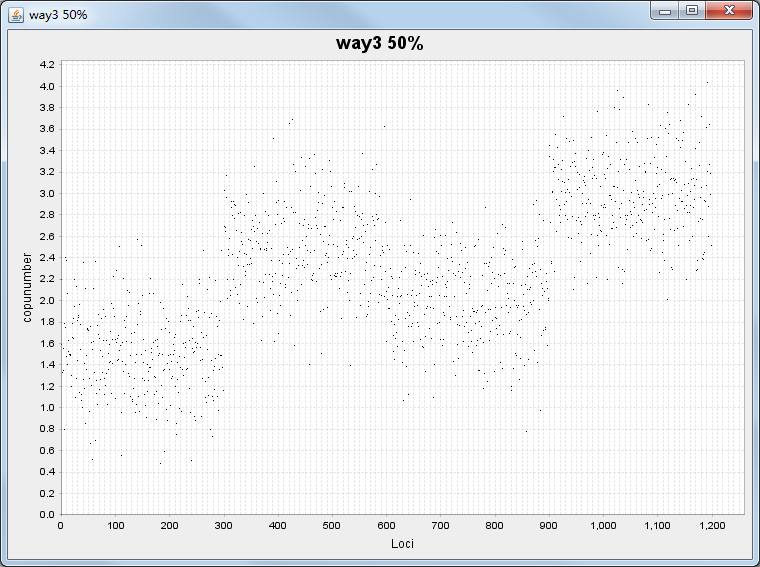

>   Figure 10.Data’s figure

>   Another source is the data input by users. Users can choose the input path
>   and the output path, as shown in figure 11. They also can choose whether the
>   input data is used to be tested. The input file should be .txt file like
>   this way:

>   chrId Loci CNValue 1 0 1.123846

>   1 1 1.057979

>   1 2 1.061475.....

>   chrId is the serial number of Chromosome. Loci is the position of copy
>   number. CNValue is the copy number value.

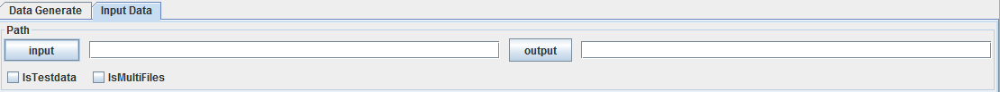

>   Figure 11.Input data

1.  Algorithms Module

>   Another module is “Algorithms”, where user can choose the algorithm they
>   like, as is shown in Figure 12.

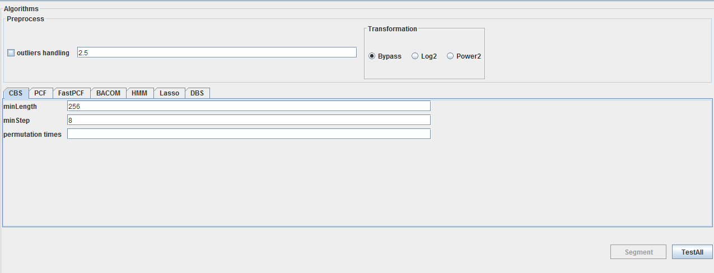

>   Figure 12.Algorithms Module

>   The top is “Preprocess”, the left of which is “outliers handling”. You can
>   set the range of the “outliers handling” and choose whether you want to do
>   “outliers handling”. The right is “Transformation”. You can choose only one
>   of the three transformations. “Bypass” means that you don’t want to
>   transform the data and process directly. “Log2” and “Pow2” respectively mean
>   that the data will be transformed by taking a logarithm of 2 and 2 times
>   square.

>   The bottom is algorithms. There are seven algorithms that can be chosen,
>   “CBS”, “PCF”, “FastPCF”, “BACOM”, “HMM”, “Lasso” and “DBS”, all of which
>   have their corresponding parameters that can be set. Click an algorithm, and
>   you can set corresponding parameters.

**For CBS and BACOM:** As shown in Figure 13 and 14, “minLength” means the
minimum length of segment. It can influence the speed and accuracy of the
algorithm. While minLength is smaller, the result is more accurate. While it can
slow down the speed of algorithm. “minStep” means The step length when
traversing the copy number sequence. For CBS, it involves permutation test, so
user can adjust “permutation times”. For BACOM, it involves Center Limit Theory,
“pvalue“ is the threshold to judge whether isolates the theory.

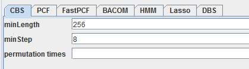

>   Figure 13.CBS Figure 14.BACOM

**For PCF and FastPCF:** As shown in Figure 15 and 16, “gama” stands for the
fixed penalty. PCF utilizes penalized least squares regression to determine a
piecewise constant fit to the data, introducing a fixed penalty γ \> 0 for any
difference in the fitted values of two neighboring observations induces an
optimal solution of particular relevance to copy number data.

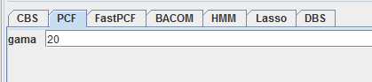

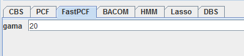

>   Figure 15. PCF Figure 16. FastPCF

**For HMM:** As shown in Figure 17, “Center Probability” stands for the
probability that in transition probability matrix, a state to maintain existing
state probability. Probability are divided into ten parts. You just have to set
center probability takes how much.

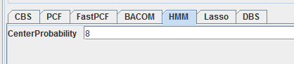

Figure 17.HMM

**For Lasso:** As shown in Figure 18, “lamda” is a constant for L1 regression.
“tolerance” means when the difference of result of twice calculation is less
than tolerance, calculation finish. “maxIter” is the number of iterations of the
algorithm.

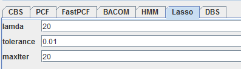

Figure 18.Lasso

**For DBS:** As shown in Figure 19, “minLength” means the minimum length of
segment. “pvalue“ is the threshold to judge whether isolates the theory. “lamda”
is a constant for L1 regression.

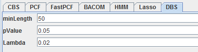

Figure 19.DBS

>   When the data, the algorithm and their parameters all are prepared, you can
>   choose “Segment” or “TestAll”, as is shown in Figure 20. “Segment” means
>   segmenting by current algorithm, and “TestAll” means segmenting by all
>   algorithms.

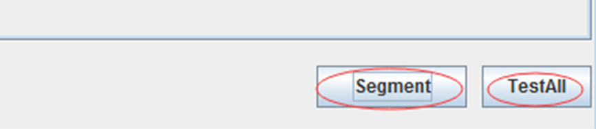

>   Figure 20.Segment and TestAll

>   After segmented, the result will be saved as a .png picture for every
>   algorithm in the path ..//Pictures. For example, the result of HMM is shown
>   in Figure 21. When “TestAll”, the results of all algorithms will also be
>   saved as a .png picture in the path ..//Result, as is shown in Figure 22.
>   All results will be shown in the console, as is shown in Figure 23.

>   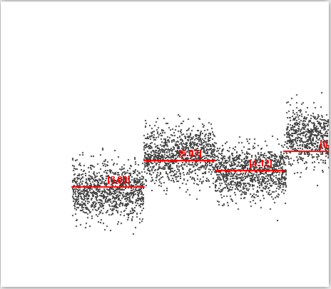

>   Figure 21.Picture of HMM

>   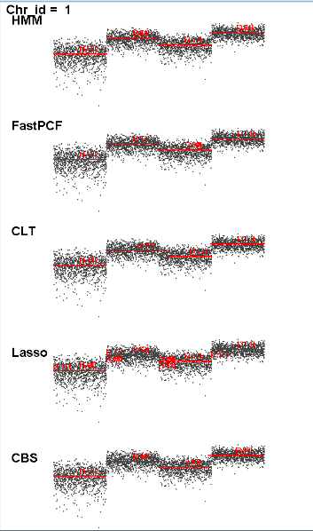

>   Figure 22.Picture of all

>   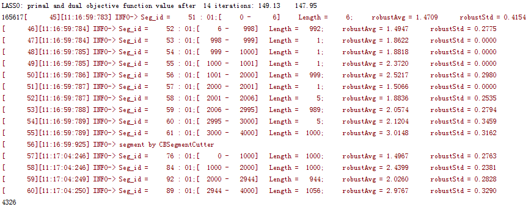

>   Figure 23.Picture of console
