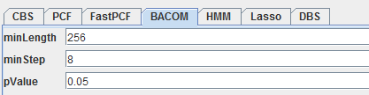

# ToolSeg 1.2 Software User Manual

## 1. Introduction

ToolSeg is an open-source, cross-platform Java application that integrates simulation data generation and segmentation achievement. The methods in the system include HMM, PCF, FastPCF, CBS, CLT and Lasso. It not only can be used for comparison between the methods, as well as meeting the needs of the actual segmentation. Most importantly, we will be staging structured. Each segment corresponding method parameters can be adjusted to facilitate users find problems. The input to be segmented can be the data generated by users or the input data that has the certain format. To meet with diverse needs and applications in the cancer research community, ToolSeg not only output .txt file of segmentation result that can be used for further analysis, such as estimates purity and ploidy, but also outputs graphical results that help intuitive understanding of the effect of segmentation. The software and source code of ToolSeg could be downloaded from <https://gitee.com/w3STeam/ToolSeg>. An example of use is provided.

## 2. Software System Requirement

The Java Runtime Environment (JRE) version 1.8 or higher is required to be
installed and configured properly. JRE could be downloaded at
<http://www.oracle.com/technetwork/java/javase/downloads/jre8-downloads-2133155.html>

## 3. Installation 

**Step 1:** Download a Java IDE and an up-to-date Java Development Kit (JDK).
Java SE 1.8 could be downloaded at
<http://www.oracle.com/technetwork/java/javase/downloads/index.html>, as is
shown in Figure 1.

**Step 2:** Install both software using the installation wizards. It is
recommended to install the JDK first.

Figure 1.Java SE download

**Step 3:**  Download two Zip packages ToolSeg.zip and test_data.zip from <https://gitee.com/w3STeam/ToolSeg/attach_files>. Then unzip these files to a local folder.

**Step 4:** Now, enter the folder and click the "start.bat " to run the program in Windows, as is shown in
Figure 2. (or run command “java -jar ToolSeg.jar” in Linux.)

Figure 2.Run the project

**Step 5:**
Fast run. 

1. select an input path
2. load data
3. select an aogorithm
4. segment

## 4. Usage 

Figure 3.The GUI

The GUI contains two modules：Input Selection, Algorithms, as is shown in Figure 3.

### 1) Input Selection Module
The first module is “Input Selection”, where user can choose the input data they need.

There are two data sources users can choose.

The first data source is “Data Generate”, by which, users can generate datas
they like. They can generate datas by random, by multi-template or by
template shift. They can set the datas’ format. As shown in the figure 8,we
set a data that has four segments. Their lengths are respectively 300, 300,
300, 300. Their segment values are respectively 1, 2, 3, 4. Their segment
variances are respectively 0.4, 0.4, 0.4, 0.4. And their contaminations are
all 0.5. Click “Generate”, the data will be generated,as shown in figure 4.

Click “Show”, we can see the figure, as shown in Figure 6. Click “Clear”,
the data generated will be cleared. Click “Save”, the data genereted will be
saved as .txt file in the path “..//data”.

Figure 4. Input Selection Module

Figure 5.Data generated

Figure 6. Data’s figure

Another source is the data input by users. Users can choose the input path
and the output path, as shown in figure 7. They also can choose whether the
input data is used to be tested. The input file should be .txt file like
this way:

>   chrId 	Loci		 CNValue 
>
>   1 		0 		1.123846

>   1		1 		1.057979

>   1		2 		1.061475.....

chrId is the serial number of Chromosome. Loci is the position of copy
number. CNValue is the copy number value.

Figure 7.Input data

### 2)  Algorithms Module

Another module is “Algorithms”, where user can choose the algorithm they
like, as is shown in Figure 8.

Figure 8.Algorithms Module

The top is “Preprocess”, the left of which is “outliers handling”. You can
set the range of the “outliers handling” and choose whether you want to do
“outliers handling”. The right is “Transformation”. You can choose only one
of the three transformations. “Bypass” means that you don’t want to
transform the data and process directly. “Log2” and “Pow2” respectively mean
that the data will be transformed by taking a logarithm of 2 and 2 times
square.

The bottom is algorithms. There are seven algorithms that can be chosen,
“CBS”, “PCF”, “FastPCF”, “BACOM”, “HMM”, “Lasso” and “DBS”, all of which
have their corresponding parameters that can be set. Click an algorithm, and
you can set corresponding parameters.

**For CBS and BACOM:** As shown in Figure 9 and 10, “minLength” means the
minimum length of segment. It can influence the speed and accuracy of the
algorithm. While minLength is smaller, the result is more accurate. While it can
slow down the speed of algorithm. “minStep” means The step length when
traversing the copy number sequence. For CBS, it involves permutation test, so
user can adjust “permutation times”. For BACOM, it involves Center Limit Theory,
“pvalue“ is the threshold to judge whether isolates the theory.

Figure 9.CBS

Figure 10.BACOM

**For PCF and FastPCF:** As shown in Figure 11 and 12, “gama” stands for the
fixed penalty. PCF utilizes penalized least squares regression to determine a
piecewise constant fit to the data, introducing a fixed penalty γ \> 0 for any
difference in the fitted values of two neighboring observations induces an
optimal solution of particular relevance to copy number data.

Figure 11. PCF 

Figure 12. FastPCF

**For HMM:** As shown in Figure 13, “Center Probability” stands for the
probability that in transition probability matrix, a state to maintain existing
state probability. Probability are divided into ten parts. You just have to set
center probability takes how much.

Figure 13.HMM

**For Lasso:** As shown in Figure 14, “lamda” is a constant for L1 regression.
“tolerance” means when the difference of result of twice calculation is less
than tolerance, calculation finish. “maxIter” is the number of iterations of the
algorithm.

Figure 14.Lasso

**For DBS:** As shown in Figure 15, “minLength” means the minimum length of
segment. “pvalue“ is the threshold to judge whether isolates the theory. “lamda”
is a constant for L1 regression.

Figure 15.DBS

When the data, the algorithm and their parameters all are prepared, you can
choose “Segment” or “TestAll”, as is shown in Figure 16. “Segment” means
segmenting by current algorithm, and “TestAll” means segmenting by all
algorithms.

Figure 16.Segment and TestAll

After segmented, the result will be saved as a .png picture for every
algorithm in the path ..//Pictures. For example, the result of HMM is shown
in Figure 17. When “TestAll”, the results of all algorithms will also be
saved as a .png picture in the path ..//Result, as is shown in Figure 18.
All results will be shown in the console, as is shown in Figure 19.

Figure 17.Picture of HMM

Figure 18. Picture of all results

Figure 19.Picture of console

### 3）Batch processing

When selecting the data input by users, users can choose whether to batch process, as shown in figure 24. When users choose to batch process, the input file should be .txt file and the content should be like this way:
>   .\data\testdata2\LTestdata_20161026_151708.txt
>
>   .\data\testdata2\LTestdata_20161026_152635.txt

>   .\data\testdata2\R_Testdata_20161026_151627.txt

>   .\data\testdata2\R_Testdata_20161026_153220.txt

Here, each .txt file must be one of the above input files.

Figure 20.Picture of batch processing